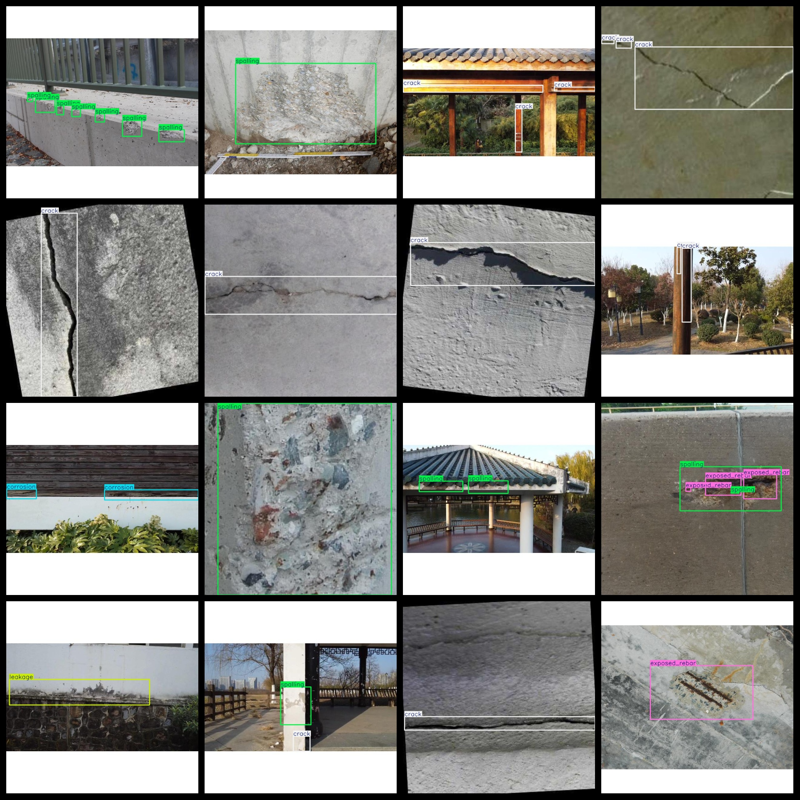
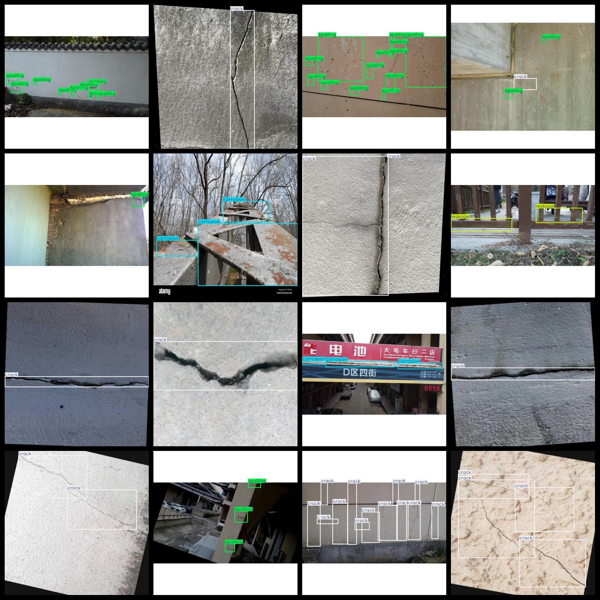
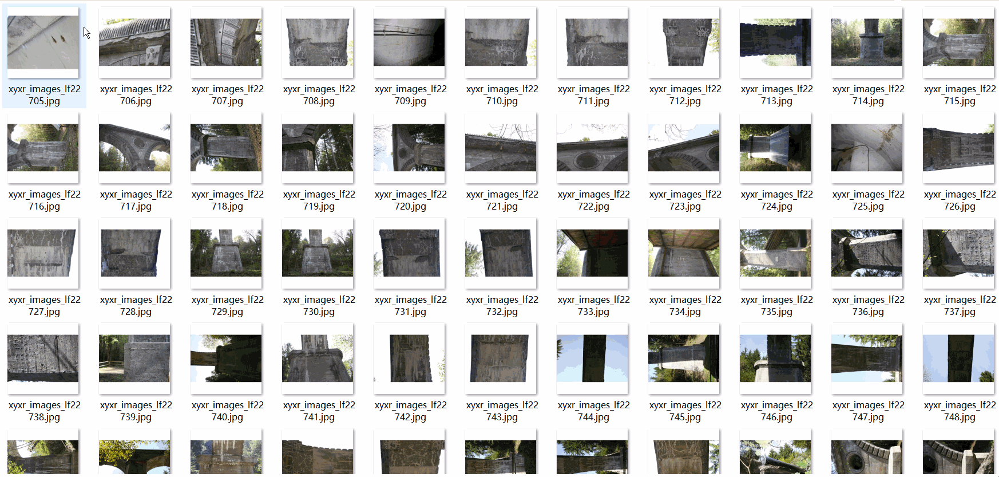

# Building a Get Surface Bridge Surface Road Surface Defect Detection Dataset: 57,587 Images (VOC+YOLO format)

Dataset format: Pascal VOC format plus YOLO format (excluding split paths' txt files, containing only jpg images and corresponding VOC format xml files and yolo format txt files).

Number of images (jpg file count): 57587

Number of labeled files (xml file count): 57587

Number of labeled files (txt file count): 57587

Number of labeled categories: 10

Repository location: datasets_sl

Labeled category names (Note that the order of labels in the yolo format does not correspond to this one, but is based on the classes.txt file in the labels folder): ["bulge", "corrosion", "crack", "efflorescence", "expansion joint", "exposed rebar", "honeycomb", "leakage", "spalling", "stain"]

Chinese translation for labels: Bulging, corrosion, crack, frosting, expansion joint, exposed rebar, honeycomb, leakage, spalling, stain

Number of bounding boxes per category:

Bulge Bounding Boxes = 1849

Corrosion Bounding Boxes = 14493

Crack Bounding Boxes = 49636

Efflorescence Bounding Boxes = 19128

Expansion Joint Bounding Boxes = 417

Exposed Rebar Bounding Boxes = 15924

Honeycomb Bounding Boxes = 2342

Leakage Bounding Boxes = 17822

Spalling Bounding Boxes = 43031

Stain Bounding Boxes = 13330

Total Bounding Boxes: 177972

Number of images per category:

Bulge Images = 1168

Corrosion Images = 3508

Crack Images = 26777

Efflorescence Images = 6407

Expansion Joint Images = 264

Exposed Rebar Images = 5693

Honeycomb Images = 1435

Leakage Images = 7310

Spalling Images = 13469

Stain Images = 5742

Image resolution: 640x640

Annotation tool used: labelImg

Dataset enhancement status: Yes

Annotation rules: Draw bounding boxes around the categories.

Important note: The dataset does not have a division into training, validation, or test sets; you need to divide it yourself.

Special statement: This dataset does not guarantee the accuracy of models trained or weight files.

## Images

---

Here is a pay link on Stripe (https://buy.stripe.com/3cs8yP7sY87d0vu9AB). Please contact me lonlonago@foxmail.com after funding $89, and I will send you a complete data files, thank you!

